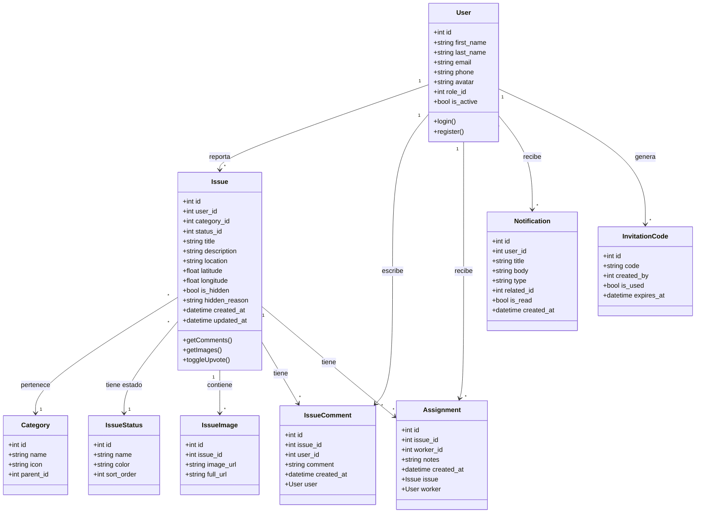
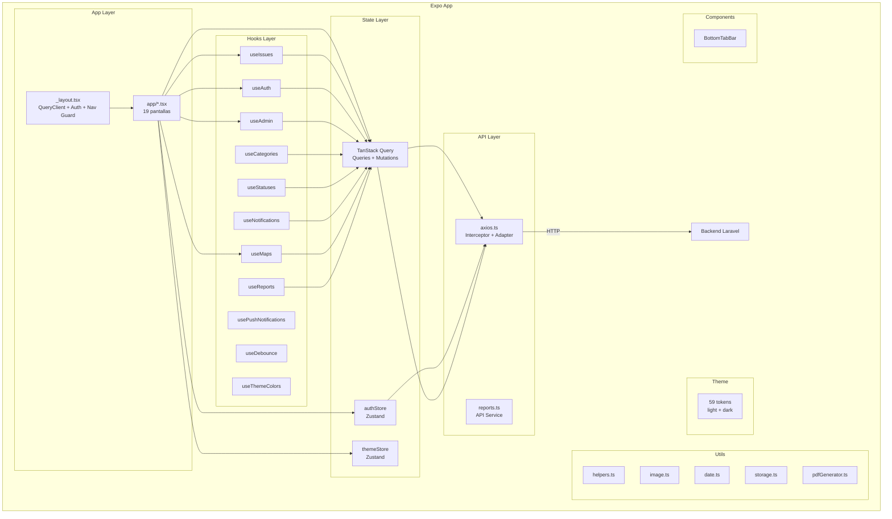
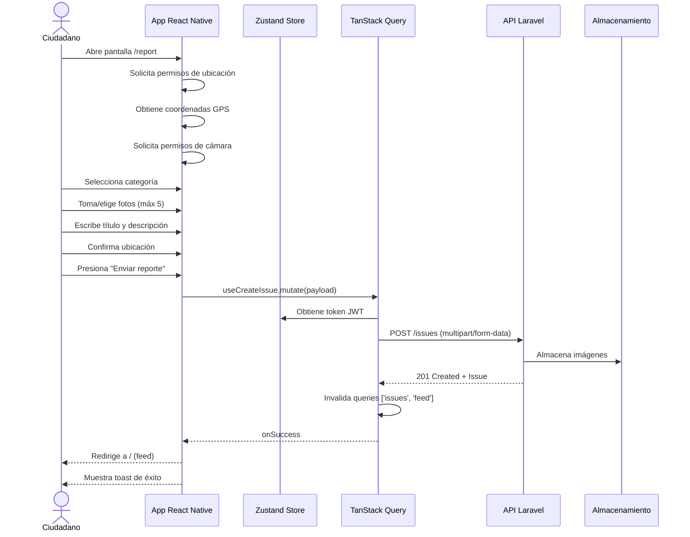
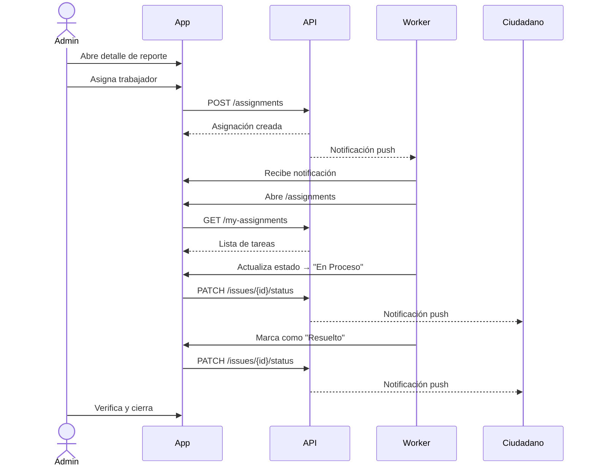

# CityFix — Documentación Técnica y Funcional del Proyecto

**Versión:** 1.0.0  
**Plataforma:** iOS, Android, Web  
**Frontend:** React Native (Expo SDK 54) + TypeScript 5.9  
**Backend:** Laravel 12 + PHP 8.2 (Railway)  
**Base de Datos:** SQLite / MySQL / PostgreSQL  
**Última actualización:** Mayo 2026

---

## Índice

1. [Descripción del Proyecto](#1-descripción-del-proyecto)
2. [Objetivos](#2-objetivos)
3. [Arquitectura del Sistema](#3-arquitectura-del-sistema)
4. [Diagramas UML](#4-diagramas-uml)
5. [Modelo de Datos](#5-modelo-de-datos)
6. [Tecnologías Utilizadas](#6-tecnologías-utilizadas)
7. [Requerimientos del Sistema](#7-requerimientos-del-sistema)
8. [Manual de Usuario](#8-manual-de-usuario)
9. [Guía de Instalación y Configuración](#9-guía-de-instalación-y-configuración)
10. [API — Endpoints](#10-api--endpoints)
11. [Estructura del Proyecto](#11-estructura-del-proyecto)
12. [Apéndice](#apéndice)

---

## 1. Descripción del Proyecto

**CityFix** es una plataforma cívica digital que conecta a ciudadanos con sus gobiernos municipales para reportar, dar seguimiento y resolver problemas urbanos. Su objetivo es transformar la gestión de incidencias ciudadanas mediante una interfaz móvil moderna, geolocalización, notificaciones push y un flujo de trabajo basado en roles.

La aplicación permite que cualquier ciudadano registre reportes con fotos, ubicación y categoría; que los **trabajadores municipales** reciban asignaciones para resolverlos; y que los **administradores** gestionen categorías, estados, usuarios, reportes y campañas de notificación.

---

## 2. Objetivos

### Objetivo General
Desarrollar una plataforma multiplataforma que permita la gestión integral de reportes de problemas urbanos, optimizando la comunicación entre ciudadanos y autoridades municipales.

### Objetivos Específicos
- Proveer un sistema de reporte con captura de imágenes (cámara/galería), geolocalización automática y categorización.
- Implementar autenticación segura mediante email/contraseña y Google Sign-In.
- Permitir la asignación de trabajadores a reportes y el seguimiento del estado (pendiente → en proceso → resuelto).
- Facilitar la administración del sistema: usuarios, categorías, estados, códigos de invitación y campañas de notificación push.
- Generar reportes analíticos para la toma de decisiones: resumen global, tendencias temporales, rendimiento por trabajador y distribución por categoría.
- Soportar modo oscuro y diseño responsivo (mobile-first con soporte web).
- Garantizar la persistencia de sesión mediante almacenamiento seguro (SecureStore / Keychain).

---

## 3. Arquitectura del Sistema

### 3.1 Visión General

CityFix sigue una **arquitectura cliente-servidor** con un frontend React Native (Expo) que se comunica con un backend Laravel mediante una API RESTful. El frontend se despliega en iOS, Android y Web; el backend se aloja en Railway.

```
┌─────────────────────────────────────────────────────────────┐
│                     CLIENTE (App)                            │
│  ┌────────────┐  ┌────────────┐  ┌───────────────────────┐  │
│  │  Expo SDK  │  │  React     │  │  Expo Router          │  │
│  │  54        │  │  Native    │  │  (File-based Routing) │  │
│  └────────────┘  └────────────┘  └───────────────────────┘  │
│  ┌────────────┐  ┌────────────┐  ┌───────────────────────┐  │
│  │  Zustand   │  │  TanStack  │  │  Axios + Interceptors│  │
│  │  (Auth/    │  │  React     │  │  + Custom Adapter    │  │
│  │   Theme)   │  │  Query     │  │  (categorías offline)│  │
│  └────────────┘  └────────────┘  └───────────────────────┘  │
└──────────────────────┬──────────────────────────────────────┘
                       │ HTTPS / JSON (JWT Bearer Token)
                       ▼
┌─────────────────────────────────────────────────────────────┐
│                   SERVIDOR (Laravel 12 / PHP 8.2)            │
│                                                              │
│  ┌──────────────────────────────────────────────────────┐   │
│  │              MIDDLEWARE STACK                         │   │
│  │  CORS → auth:api (JWT) → RoleMiddleware(Admin/Worker)│   │
│  └──────────────────────────────────────────────────────┘   │
│                                                              │
│  ┌───────────┐ ┌───────────┐ ┌───────────┐ ┌────────────┐  │
│  │  Auth     │ │  Issues   │ │  Admin    │ │  Maps      │  │
│  │  Ctrl     │ │  Ctrl     │ │  Ctrl     │ │  Proxy     │  │
│  ├───────────┤ ├───────────┤ ├───────────┤ ├────────────┤  │
│  │  JWT Auth │ │  CRUD +   │ │  Users    │ │  Geocode   │  │
│  │  Google   │ │  Feed +   │ │  Issues   │ │  Reverse   │  │
│  │  Register │ │  Upvote   │ │  Reports  │ │  Places    │  │
│  │  Password │ │  Comments  │ │  Campaign │ │            │  │
│  │  Reset    │ │  History   │ │  Codes    │ │            │  │
│  └───────────┘ └───────────┘ └───────────┘ └────────────┘  │
│                                                              │
│  ┌──────────────────────────────────────────────────────┐   │
│  │              SERVICES + OBSERVERS                     │   │
│  │  FcmService (Firebase/Expo Push)                     │   │
│  │  IssueObserver (notifica nuevos issues)              │   │
│  │  CommentObserver (notifica nuevos comentarios)       │   │
│  └──────────────────────────────────────────────────────┘   │
│                                                              │
│  ┌──────────────────────────────────────────────────────┐   │
│  │              ALMACENAMIENTO                           │   │
│  │  Local (public/)  o  Cloudflare R2 (S3-compatible)   │   │
│  └──────────────────────────────────────────────────────┘   │
│  ┌────────────────────┐  ┌────────────────────┐            │
│  │  SQLite / MySQL    │  │  Redis (cache/     │            │
│  │  / PostgreSQL      │  │  queue/session)    │            │
│  └────────────────────┘  └────────────────────┘            │
└─────────────────────────────────────────────────────────────┘
```

### 3.2 Patrón de Gestión de Estado

CityFix emplea un **modelo híbrido** de gestión de estado:

| Tipo | Tecnología | Propósito |
|------|-----------|-----------|
| Estado del cliente | **Zustand** | Auth (token, usuario), tema (light/dark) |
| Estado del servidor | **TanStack React Query** | Toda la data de API: reportes, categorías, comentarios, usuarios, notificaciones |
| Cache local | **expo-secure-store** + **Map en memoria** | Token JWT, votos locales (`has_voted`), categorías offline |

### 3.3 Flujo de Autenticación

```
Inicio
  │
  ▼
initializeAuth() ───────────────┐
  │                             │
  ▼                             │
¿Token en SecureStore? ──No──►  │
  │ Sí                          │
  ▼                             │
GET /auth/me ────Error ──► logout() ──► Sesión vacía
  │ Éxito
  ▼
setUser(data) ──► isLoading = false
  │
  ▼
¿Token existe + está en ruta auth? ──Sí──► redirect → /
¿No token + no está en ruta auth? ──Sí──► redirect → /welcome
```

### 3.4 Roles de Usuario

Los roles se almacenan en la tabla `roles` y se asignan mediante la clave foránea `role_id` en `users`. El middleware `RoleMiddleware` verifica el nombre del rol (case-insensitive) para autorizar rutas administrativas.

| role_id | Nombre en DB | Rol | Descripción |
|---------|-------------|-----|-------------|
| 1 | `Admin` | **Administrador** | Acceso total: panel de administración, usuarios, categorías, reportes analíticos, campañas push, gestión de estados, códigos de invitación |
| 2 | `Worker` | **Trabajador Municipal** | Recibe asignaciones, actualiza estado de reportes, consulta sus tareas |
| 3 | `Citizen` | **Ciudadano** | Reporta problemas, comenta, vota, ve mapa, consulta sus reportes |

El middleware acepta múltiples roles con sintaxis: `role:Admin` o `role:Worker,Admin`. Retorna **401** si no hay sesión, **403** si el rol no está autorizado.

---

## 4. Diagramas UML

### 4.1 Diagrama de Casos de Uso

```mermaid
graph TD
    Actor_C[Ciudadano] --> UC1[Registrarse / Iniciar sesión]
    Actor_C --> UC2[Crear reporte con foto y ubicación]
    Actor_C --> UC3[Ver feed de reportes]
    Actor_C --> UC4[Filtrar y buscar reportes]
    Actor_C --> UC5[Ver detalle de reporte]
    Actor_C --> UC6[Comentar reporte]
    Actor_C --> UC7[Votar reporte (upvote)]
    Actor_C --> UC8[Ver mapa de reportes]
    Actor_C --> UC9[Ver mis reportes]
    Actor_C --> UC10[Editar perfil]
    Actor_C --> UC11[Recibir notificaciones]

    Actor_W[Trabajador] --> UC12[Ver mis asignaciones]
    Actor_W --> UC13[Actualizar estado de reporte]
    Actor_W --> UC14[Dejar nota en asignación]

    Actor_A[Administrador] --> UC15[Gestionar usuarios]
    Actor_A --> UC16[Gestionar categorías]
    Actor_A --> UC17[Gestionar estados]
    Actor_A --> UC18[Asignar trabajador a reporte]
    Actor_A --> UC19[Ocultar/archivar reporte]
    Actor_A --> UC20[Ver panel de reportes analíticos]
    Actor_A --> UC21[Enviar campaña de notificación push]
    Actor_A --> UC22[Generar códigos de invitación]
    Actor_A --> UC23[Editar cualquier reporte]

    UC2 --> UC2a[Tomar foto con cámara]
    UC2 --> UC2b[Seleccionar de galería]
    UC2 --> UC2c[Usar ubicación actual]
    UC2 --> UC2d[Seleccionar categoría]
```

### 4.2 Diagrama de Clases (Modelo de Datos)



### 4.3 Diagrama de Componentes (Frontend)



### 4.4 Diagrama de Secuencia — Crear Reporte



### 4.5 Diagrama de Secuencia — Flujo de Asignación y Resolución



---

## 5. Modelo de Datos

### 5.1 Esquemas de Base de Datos (Migraciones)

A continuación se detallan las **22 migraciones** del backend Laravel con sus columnas, tipos, restricciones y relaciones.

#### `roles`
| Columna | Tipo | Restricciones |
|---------|------|---------------|
| id | bigIncrements | PK |
| name | string(100) | UNIQUE, NOT NULL |
| description | string | NULL |
| created_at / updated_at | timestamps | |

#### `permissions`
| Columna | Tipo | Restricciones |
|---------|------|---------------|
| id | bigIncrements | PK |
| name | string(100) | UNIQUE, NOT NULL |
| description | string | NULL |
| created_at / updated_at | timestamps | |

#### `role_permissions` (pivote)
| Columna | Tipo | Restricciones |
|---------|------|---------------|
| id | bigIncrements | PK |
| role_id | foreignId | FK → roles(id) ON DELETE CASCADE |
| permission_id | foreignId | FK → permissions(id) ON DELETE CASCADE |
| | | UNIQUE(role_id, permission_id) |

#### `users`
| Columna | Tipo | Restricciones |
|---------|------|---------------|
| id | bigIncrements | PK |
| first_name | string | NOT NULL |
| last_name | string | NOT NULL |
| email | string | UNIQUE, NOT NULL |
| password | string | NULL (nullable si usa Google OAuth) |
| google_id | string | UNIQUE, NULL |
| phone | string | NULL |
| avatar | string | NULL |
| role_id | foreignId | FK → roles(id), default 3 (Citizen) |
| fcm_token | string | NULL (token de notifications push) |
| is_active | boolean | DEFAULT true |
| created_at / updated_at | timestamps | |
| | | INDEX(role_id), INDEX(email) |

#### `password_resets`
| Columna | Tipo | Restricciones |
|---------|------|---------------|
| id | bigIncrements | PK |
| user_id | foreignId | FK → users(id) ON DELETE CASCADE |
| token | string(64) | UNIQUE, NOT NULL |
| expires_at | timestamp | NOT NULL |
| used_at | timestamp | NULL |
| created_at / updated_at | timestamps | |

#### `categories`
| Columna | Tipo | Restricciones |
|---------|------|---------------|
| id | bigIncrements | PK |
| name | string | NOT NULL |
| icon | string | NULL |
| parent_id | foreignId(NULL) | FK → categories(id) ON DELETE SET NULL |
| created_at / updated_at | timestamps | |

#### `issue_status`
| Columna | Tipo | Restricciones |
|---------|------|---------------|
| id | bigIncrements | PK |
| name | string(100) | UNIQUE, NOT NULL |
| color | string | NULL |
| sort_order | integer | DEFAULT 0 |
| created_at / updated_at | timestamps | |

#### `issues`
| Columna | Tipo | Restricciones |
|---------|------|---------------|
| id | bigIncrements | PK |
| user_id | foreignId | FK → users(id) |
| category_id | foreignId | FK → categories(id) |
| status_id | foreignId | FK → issue_status(id) |
| title | string | NOT NULL |
| description | text | NULL |
| location | string | NULL |
| latitude | decimal(10,7) | NULL |
| longitude | decimal(10,7) | NULL |
| is_hidden | boolean | DEFAULT false |
| hidden_reason | string | NULL |
| created_at / updated_at | timestamps | |
| | | INDEX(user_id), INDEX(category_id), INDEX(status_id), INDEX(is_hidden), INDEX(lat, lng) |

#### `issue_history`
| Columna | Tipo | Restricciones |
|---------|------|---------------|
| id | bigIncrements | PK |
| issue_id | foreignId | FK → issues(id) ON DELETE CASCADE |
| status_id | foreignId | FK → issue_status(id) |
| changed_by | foreignId | FK → users(id) |
| changed_at | timestamp | useCurrent |
| | | INDEX(issue_id), INDEX(changed_by) |

#### `issue_images`
| Columna | Tipo | Restricciones |
|---------|------|---------------|
| id | bigIncrements | PK |
| issue_id | foreignId | FK → issues(id) ON DELETE CASCADE |
| image_url | string | NOT NULL |
| created_at | timestamp | useCurrent |
| | | INDEX(issue_id) |

#### `assignment_status`
| Columna | Tipo | Restricciones |
|---------|------|---------------|
| id | bigIncrements | PK |
| name | string(100) | UNIQUE, NOT NULL |
| created_at / updated_at | timestamps | |

#### `assignments`
| Columna | Tipo | Restricciones |
|---------|------|---------------|
| id | bigIncrements | PK |
| issue_id | foreignId | FK → issues(id) ON DELETE CASCADE |
| worker_id | foreignId | FK → users(id) ON DELETE CASCADE |
| status_id | foreignId | FK → assignment_status(id) |
| notes | text | NULL |
| assigned_at | timestamp | useCurrent |
| created_at / updated_at | timestamps | |
| | | INDEX(issue_id), INDEX(worker_id), INDEX(status_id) |

#### `upvotes`
| Columna | Tipo | Restricciones |
|---------|------|---------------|
| id | bigIncrements | PK |
| user_id | foreignId | FK → users(id) ON DELETE CASCADE |
| issue_id | foreignId | FK → issues(id) ON DELETE CASCADE |
| | | UNIQUE(user_id, issue_id) |

#### `comments`
| Columna | Tipo | Restricciones |
|---------|------|---------------|
| id | bigIncrements | PK |
| user_id | foreignId | FK → users(id) |
| issue_id | foreignId | FK → issues(id) ON DELETE CASCADE |
| comment | text | NOT NULL |
| created_at / updated_at | timestamps | |
| | | INDEX(issue_id), INDEX(user_id) |

#### `notifications`
| Columna | Tipo | Restricciones |
|---------|------|---------------|
| id | bigIncrements | PK |
| user_id | foreignId | FK → users(id) ON DELETE CASCADE |
| type | string | NULL |
| title | string | NOT NULL |
| message | text | NULL |
| related_id | unsignedBigInteger | NULL (ID del issue relacionado) |
| is_read | boolean | DEFAULT false |
| created_at / updated_at | timestamps | |
| | | INDEX(user_id), INDEX(user_id, is_read) |

#### `invitation_codes`
| Columna | Tipo | Restricciones |
|---------|------|---------------|
| id | bigIncrements | PK |
| code | string(50) | UNIQUE, NOT NULL |
| role_id | foreignId | FK → roles(id) ON DELETE CASCADE |
| is_active | boolean | DEFAULT true |
| expires_at | timestamp | NULL |
| max_uses | unsignedInteger | NULL |
| used_count | unsignedInteger | DEFAULT 0 |
| created_at / updated_at | timestamps | |

#### `sessions`, `cache`, `cache_locks`
Tablas del framework Laravel para sesiones (driver database), caché y locks.

### 5.2 Relaciones entre Modelos (Eloquent)

| Modelo | Relación | Modelo relacionado | Descripción |
|--------|----------|--------------------|-------------|
| **User** | `belongsTo` | Role | Un usuario tiene un rol |
| **Role** | `hasMany` | User | Un rol tiene muchos usuarios |
| **Role** | `belongsToMany` | Permission (vía `role_permissions`) | Un rol tiene muchos permisos |
| **Category** | `belongsTo` | Category (parent_id) | Subcategoría → categoría padre |
| **Category** | `hasMany` | Category (parent_id) | Categoría padre → subcategorías |
| **Category** | `hasMany` | Issue | Una categoría tiene muchos issues |
| **Issue** | `belongsTo` | User | El usuario que reportó |
| **Issue** | `belongsTo` | Category | La categoría del issue |
| **Issue** | `belongsTo` | IssueStatus | El estado actual |
| **Issue** | `hasMany` | IssueImage | Imágenes del issue |
| **Issue** | `hasMany` | Upvote | Votos del issue |
| **Issue** | `hasMany` | Comment | Comentarios del issue |
| **Issue** | `hasMany` | IssueHistory | Historial de cambios de estado |
| **Issue** | `hasMany` | Assignment | Asignaciones a workers |
| **Issue** | `belongsToMany` | User (vía Assignment) | Workers asignados |
| **Comment** | `belongsTo` | Issue | Issue comentado |
| **Comment** | `belongsTo` | User | Autor del comentario |
| **Upvote** | `belongsTo` | Issue | Issue votado |
| **Upvote** | `belongsTo` | User | Usuario que votó |
| **Assignment** | `belongsTo` | Issue | Issue asignado |
| **Assignment** | `belongsTo` | User (worker_id) | Worker asignado |
| **Assignment** | `belongsTo` | AssignmentStatus | Estado de la asignación |
| **Notification** | `belongsTo` | User | Usuario notificado |
| **PasswordReset** | `belongsTo` | User | Usuario que solicita reset |
| **InvitationCode** | `belongsTo` | Role | Rol que otorga el código |

### 5.3 Convenciones de la API

- **Formato de respuesta paginada:** `{ data: [], current_page, last_page, per_page, total }`
- **Autenticación:** Bearer token JWT en header `Authorization`
- **Formato de imágenes:** Multipart/form-data para creación/edición
- **Método PUT en Laravel:** Se envía `_method=PUT` como campo del FormData

---

## 6. Tecnologías Utilizadas

### Frontend

| Tecnología | Versión | Propósito |
|-----------|---------|-----------|
| React Native | 0.81.5 | Framework móvil multiplataforma |
| Expo SDK | 54 | Entorno de desarrollo y tooling |
| TypeScript | 5.9 | Tipado estático |
| expo-router | 6 | Enrutamiento basado en archivos |
| TanStack React Query | 5 | Gestión de estado del servidor |
| Zustand | 5 | Estado del cliente (auth, theme) |
| Axios | 1.13 | Cliente HTTP con interceptores |
| react-native-maps | 1.20 | Mapas nativos (Google Maps) |
| expo-location | 19 | Geolocalización |
| expo-image-picker | 17 | Selección de imágenes (cámara/galería) |
| expo-secure-store | 15 | Almacenamiento seguro de tokens |
| expo-notifications | - | Notificaciones push |
| expo-print / expo-sharing | - | Generación y exportación de PDF |
| @expo/vector-icons | 15 | Iconografía (Ionicons, FontAwesome5, etc.) |
| expo-linear-gradient | 15 | Degradados visuales |
| react-native-reanimated | 4.1 | Animaciones |

### Backend (Laravel 12 — Railway)

| Tecnología | Versión | Propósito |
|-----------|---------|-----------|
| PHP | ^8.2 | Lenguaje de programación |
| Laravel Framework | ^12.0 | Framework PHP para la API REST |
| tymon/jwt-auth | ^2.3 | Autenticación JWT (principal) |
| php-open-source-saver/jwt-auth | ^2.8 | JWT alternativo |
| google/apiclient | ^2.19 | Verificación de tokens Google Sign-In |
| intervention/image | ^3.0 | Optimización de imágenes (redimensionar, convertir a JPEG) |
| owen-it/laravel-auditing | ^14.0 | Auditoría de cambios en modelos (Issue, Assignment, Comment) |
| kreait/laravel-firebase | - | Firebase Cloud Messaging (notificaciones push) |
| league/flysystem-aws-s3-v3 | ^3.34 | Almacenamiento Cloudflare R2 (S3-compatible) |
| SQLite / MySQL / PostgreSQL | - | Base de datos relacional |
| Redis | - | Caché, sesiones, cola de trabajos |
| Google Maps API | - | Geocoding, reverse geocoding, Places Autocomplete |
| Laravel Reverb | - | WebSockets configurado (en .env) |

### Herramientas de Desarrollo

| Herramienta | Propósito |
|------------|-----------|
| ESLint 9 + eslint-config-expo | Linting del frontend |
| Laravel Pint | Code style fixer del backend |
| PHPUnit 11 | Testing del backend |
| EAS Build (Expo) | Build y deploy del frontend |
| Docker + Laravel Sail | Entorno de desarrollo local |
| Git + GitHub | Control de versiones |

---

## 7. Requerimientos del Sistema

### 7.1 Requerimientos Funcionales

| ID | Requerimiento | Módulo |
|----|---------------|--------|
| RF01 | El sistema debe permitir registro de usuarios con email, contraseña, nombre y teléfono | Auth |
| RF02 | El sistema debe permitir inicio de sesión con email/contraseña y Google Sign-In | Auth |
| RF03 | El sistema debe permitir recuperación de contraseña mediante código de verificación | Auth |
| RF04 | El sistema debe permitir crear reportes con título, descripción, categoría, ubicación (GPS/manual) y hasta 5 fotos | Reportes |
| RF05 | El sistema debe mostrar un feed paginado de reportes con búsqueda y filtros | Dashboard |
| RF06 | El sistema debe permitir ver el detalle de un reporte con imágenes, comentarios, historial y reportes cercanos | Detalle |
| RF07 | El sistema debe permitir comentar en reportes | Detalle |
| RF08 | El sistema debe permitir votar (upvote) reportes con actualización optimista | Detalle |
| RF09 | El sistema debe mostrar un mapa con marcadores de todos los reportes | Mapa |
| RF10 | El sistema debe permitir filtrar reportes por estado (pendiente, en proceso, resuelto) | Dashboard |
| RF11 | El sistema debe permitir filtrar reportes por ciudadano | Dashboard |
| RF12 | El sistema debe notificar a los usuarios cuando el estado de sus reportes cambie | Notificaciones |
| RF13 | Los administradores deben poder gestionar usuarios (editar rol, activar/desactivar) | Admin |
| RF14 | Los administradores deben poder crear categorías con iconos | Admin |
| RF15 | Los administradores deben poder gestionar estados de reportes | Admin |
| RF16 | Los administradores deben poder asignar trabajadores a reportes | Admin |
| RF17 | Los administradores deben poder ocultar/archivar reportes | Admin |
| RF18 | Los administradores deben poder generar códigos de invitación para trabajadores | Admin |
| RF19 | Los administradores deben poder enviar campañas de notificación push | Admin |
| RF20 | Los administradores deben tener un panel con reportes analíticos (resumen, tendencias, rendimiento) | Admin Reports |
| RF21 | Los trabajadores deben poder ver sus asignaciones y actualizar el estado | Asignaciones |
| RF22 | El sistema debe soportar modo oscuro | Tema |
| RF23 | El sistema debe permitir editar el perfil del usuario (avatar, nombre, teléfono) | Perfil |
| RF24 | El sistema debe permitir exportar reportes a PDF | Utilidades |
| RF25 | El sistema debe mostrar reportes cercanos en el detalle de un reporte | Detalle |

### 7.2 Requerimientos No Funcionales

| ID | Requerimiento | Descripción |
|----|---------------|-------------|
| RNF01 | Multiplataforma | La app debe funcionar en iOS, Android y Web |
| RNF02 | Seguridad | Los tokens JWT deben almacenarse en SecureStore (Keychain / EncryptedSharedPreferences) |
| RNF03 | Persistencia de sesión | El token debe restaurarse al reabrir la app y validarse contra el backend |
| RNF04 | Performance | El feed debe usar scroll infinito (infinite query) con paginación |
| RNF05 | Optimismo | Los votos (upvote) deben actualizarse de forma optimista con rollback en error |
| RNF06 | Offline parcial | Las categorías creadas localmente deben persistir y mostrarse incluso sin conexión |
| RNF07 | Accesibilidad por roles | Las rutas y acciones deben restringirse según role_id |
| RNF08 | Diseño responsive | La UI debe adaptarse a distintos tamaños de pantalla (móvil y web) |
| RNF09 | Notificaciones push | Los usuarios deben recibir notificaciones sin depender del estado de la app |
| RNF10 | Linting | El código debe pasar ESLint con configuración expo |

---

## 8. Manual de Usuario

### 8.1 Roles y Acceso

| Rol | Pantallas disponibles |
|-----|----------------------|
| **Ciudadano** (role_id ≥ 3) | Welcome, Login/Registro, Dashboard (Home), Reportar, Detalle, Mapa, Mis Reportes, Notificaciones, Perfil |
| **Trabajador** (role_id = 2) | Todo lo del ciudadano + pestaña **Tareas** (asignaciones) |
| **Administrador** (role_id = 1) | Todo + pestaña **Admin** (panel de gestión) + **Reportes Admin** (analíticas) |

---

### 8.2 Flujo Completo de Uso

#### 8.2.1 Primer Ingreso (Onboarding)

1. Al abrir la app sin sesión, se muestra la pantalla de **Welcome**.
2. El usuario puede:
   - Presionar **"Iniciar sesión"** → `/login`
   - Presionar **"Crear cuenta"** → `/create-account`
   - Los trabajadores pueden presionar **"¿Eres trabajador municipal?"** → `/worker-registration`

#### 8.2.2 Registro

1. Completar: nombre, apellido, email, teléfono, contraseña.
2. Aceptar términos y condiciones.
3. Presionar **"Crear cuenta"**.
4. Opcional: presionar **"Registrarse con Google"**.

#### 8.2.3 Dashboard (Home) — `/`

```
┌─────────────────────────────────────┐
│  CityFix                           🔔│
│  Transformando el futuro urbano     │
│  ┌──────┐ ┌──────┐ ┌──────┐        │
│  │  15  │ │  8   │ │  32  │        │
│  │Pend. │ │Proce.│ │Resol.│        │
│  └──────┘ └──────┘ └──────┘        │
│  🔍 Buscar reportes...              │
│  👥 Filtrar por Ciudadano           │
│  [📷 Reportar] [📍 Ver Mapa]       │
│  ─── Reportes Recientes ───        │
│  ┌─────────────────────────────┐   │
│  │ 🖼  Bache en Av. Principal  │   │
│  │     📍 Av. Principal 123    │   │
│  │     🏷 Vialidad  👍 5 💬 2  │   │
│  └─────────────────────────────┘   │
│  ┌─────────────────────────────┐   │
│  │ 🖼  Fuga de agua en...      │   │
│  │     📍 Col. Centro          │   │
│  │     🏷 Agua  👍 3 💬 1      │   │
│  └─────────────────────────────┘   │
└─────────────────────────────────────┘
```

**Funcionalidades:**
- **Tarjetas de estadísticas**: tocar una tarjeta filtra por ese estado.
- **Buscar**: escribe para filtrar reportes por título (debounced 500ms).
- **Filtro por ciudadano**: selecciona un usuario específico.
- **Botón "Reportar"**: navega a la pantalla de creación.
- **Botón "Ver Mapa"**: navega al mapa.
- **Feed infinito**: desplázate hacia abajo para más reportes.
- **Reporte**: toca cualquier tarjeta para ver detalle.
- **Campana 🔔**: muestra notificaciones no leídas.

#### 8.2.4 Crear Reporte — `/report`

1. **Seleccionar categoría**: elige entre las disponibles (ej: Bache, Basura, Agua, Iluminación).
2. **Título**: escribe un título descriptivo.
3. **Descripción**: detalla el problema.
4. **Ubicación**:
   - Presiona 📍 para obtener ubicación automática (GPS).
   - O escribe la dirección manualmente.
5. **Fotos**: presiona 📷 (cámara) o 🖼 (galería). Máximo 5 imágenes.
   - Toca la "X" en una imagen para eliminarla.
6. Presiona **"Enviar Reporte"**.
7. Al enviar, redirige al feed con el nuevo reporte visible.

#### 8.2.5 Detalle de Reporte — `/issue-details?id={id}`

```
┌─────────────────────────────────────┐
│  ← Volver              [✏️][📄]    │
│  ┌───────────────────────────────┐  │
│  │   🖼  Carrusel de imágenes    │  │
│  └───────────────────────────────┘  │
│  ● Pendiente (naranja)             │
│  📍 Av. Principal 123              │
│  🏷 Vialidad                       │
│  ─────────────────────────────────  │
│  Descripción del problema...       │
│  ─────────────────────────────────  │
│  👍 5 votos   💬 2 comentarios     │
│  [👍 Votar]                        │
│  ─── Comentarios ───              │
│  ┌─ Usuario: Me pasa igual      ┐  │
│  │   hace 2 días                 │  │
│  └───────────────────────────────┘  │
│  💬 Escribe un comentario... [➤]  │
│  ─── Línea de Tiempo ───         │
│  ● Creado · hace 5 días           │
│  ● En Proceso · hace 2 días       │
│  ─── Reportes Cercanos ───       │
│  • Bache en Calle 2 (500m)        │
└─────────────────────────────────────┘
```

**Acciones por rol:**
| Acción | Ciudadano | Worker | Admin |
|--------|-----------|--------|-------|
| Ver detalle | ✅ | ✅ | ✅ |
| Editar (propio) | ✅ | ❌ | ✅ |
| Editar (cualquiera) | ❌ | ❌ | ✅ |
| Comentar | ✅ | ✅ | ✅ |
| Eliminar comentario | ✅ (propio) | ❌ | ✅ |
| Votar | ✅ | ✅ | ✅ |
| Cambiar estado | ❌ | ✅ | ✅ |
| Asignar trabajador | ❌ | ❌ | ✅ |
| Ocultar/Archivar | ❌ | ❌ | ✅ |
| Ver historial | ✅ | ✅ | ✅ |

#### 8.2.6 Mapa — `/map`

- **Natvo (iOS/Android)**: Mapa interactivo con marcadores. Filtros por categoría. Al tocar un marcador, se muestra una tarjeta con el título. Botón flotante para centrar en ubicación actual.
- **Web**: Mapa iframe embebido con lista de reportes debajo.

#### 8.2.7 Mis Reportes — `/my-reports`

Lista filtrada de reportes creados por el usuario actual. Soporta filtro por estado opcional via query param `?statusId=N`.

#### 8.2.8 Perfil — `/profile`

- Avatar, nombre, email.
- Estadísticas personales: reportados, en proceso, resueltos.
- Engranaje ⚙ para ir a editar perfil.

#### 8.2.9 Editar Perfil — `/edit-profile`

- Cambiar avatar (cámara o galería).
- Editar nombre, apellido, teléfono.
- Activar/desactivar **modo oscuro**.

#### 8.2.10 Notificaciones — `/notifications`

Lista de notificaciones push (leídas y no leídas). Tocar una notificación navega al reporte relacionado.

---

### 8.3 Flujo de Administrador

#### 8.3.1 Panel de Admin — `/admin`

```
┌─────────────────────────────────────┐
│  Panel de Administración            │
│  ┌──────────────────────────────┐   │
│  │ 📁 Crear Categoría           │   │
│  │   Nombre + Icono (grid)      │   │
│  └──────────────────────────────┘   │
│  ┌──────────────────────────────┐   │
│  │ 👤 Crear Usuario             │   │
│  └──────────────────────────────┘   │
│  ┌──────────────────────────────┐   │
│  │ 🔑 Generar Códigos           │   │
│  │    de Invitación             │   │
│  └──────────────────────────────┘   │
│  ┌──────────────────────────────┐   │
│  │ 📊 Crear Estado              │   │
│  └──────────────────────────────┘   │
│  ┌──────────────────────────────┐   │
│  │ 👥 Gestión de Usuarios       │   │
│  │   Buscar, editar rol,       │   │
│  │   desactivar                 │   │
│  └──────────────────────────────┘   │
│  ┌──────────────────────────────┐   │
│  │ 📦 Reportes Archivados       │   │
│  └──────────────────────────────┘   │
│  ┌──────────────────────────────┐   │
│  │ 📢 Campaña Push              │   │
│  │   Enviar notificación a      │   │
│  │   todos los usuarios         │   │
│  └──────────────────────────────┘   │
└─────────────────────────────────────┘
```

#### 8.3.2 Reportes Analíticos — `/admin-reports`

```
┌─────────────────────────────────────┐
│  Resumen de Reportes                │
│  Total: 55  |  Abiertos: 15        │
│  En Proceso: 8  |  Resueltos: 32   │
│  ─────────────────────────────────  │
│  Reportes por Estado (gráfico)     │
│  ████████░░  Pendiente  27.3%      │
│  ████░░░░░░  Proceso    14.5%      │
│  ██████████  Resuelto   58.2%      │
│  ─────────────────────────────────  │
│  Por Categoría (top)               │
│  🏗 Vialidad     22 reportes       │
│  🗑 Basura       15 reportes       │
│  💡 Iluminación  10 reportes       │
│  ─────────────────────────────────  │
│  Tendencias por Fecha              │
│  ▁▃▂▅▇▄▆  (gráfico de barras)     │
│  ─────────────────────────────────  │
│  Rendimiento por Trabajador        │
│  🧑‍🔧 Juan Pérez    12 resueltos   │
│  🧑‍🔧 María García   8 resueltos    │
└─────────────────────────────────────┘
```

---

### 8.4 Navegación por Pestañas (BottomTabBar)

| Ícono | Label | Ruta | Visibilidad |
|-------|-------|------|-------------|
| 🏠 | Home | `/` | Todos |
| 🗺 | Mapa | `/map` | Todos |
| ➕ | (FAB) | `/report` | Todos |
| 👤 | Perfil | `/profile` | Todos |
| 📋 | Tareas | `/assignments` | Workers (role_id=2) |
| ⚙️ | Admin | `/admin` | Admins (role_id=1) |

---

## 9. Guía de Instalación y Configuración

### 9.1 Requisitos Previos

- Node.js ≥ 18
- Expo CLI: `npm install -g expo-cli`
- EAS CLI (para builds): `npm install -g eas-cli`
- Xcode (iOS) o Android Studio (Android) para builds nativos
- Una cuenta en [Expo Application Services](https://expo.dev/eas)
- Google Cloud Console project con APIs: Maps SDK, Places API, Geocoding API, Google Sign-In

### 9.2 Variables de Entorno

Crear archivo `city-fix/.env`:

```env
EXPO_PUBLIC_API_URL=https://cityfix-backend-production.up.railway.app/api
EXPO_PUBLIC_GOOGLE_WEB_CLIENT_ID=xxxxx.apps.googleusercontent.com
EXPO_PUBLIC_GOOGLE_IOS_CLIENT_ID=xxxxx.apps.googleusercontent.com
```

### 9.3 Instalación

```bash
cd city-fix
npm install
```

### 9.4 Ejecución en Desarrollo

```bash
# Iniciar en web (recomendado para desarrollo rápido)
npm run web

# Iniciar en iOS (requiere Xcode)
npm run ios

# Iniciar en Android (requiere Android Studio)
npm run android
```

### 9.5 Build para Producción

```bash
# Preview (APK/IPA para pruebas internas)
eas build --profile preview --platform all

# Producción (para stores)
eas build --profile production --platform all
```

### 9.6 Backend: Instalación y Configuración

#### Requisitos
- PHP ≥ 8.2
- Composer
- SQLite (desarrollo) / MySQL o PostgreSQL (producción)
- Extensión PHP: `pdo_sqlite`, `mbstring`, `gd`, `xml`, `curl`, `fileinfo`

#### Pasos

```bash
cd laravel-app
cp .env.example .env
composer install

# Generar clave de aplicación y JWT
php artisan key:generate
php artisan jwt:secret

# Ejecutar migraciones y seeders
php artisan migrate --seed

# Iniciar servidor de desarrollo
php artisan serve
```

#### Variables de Entorno Clave (`.env`)

```env
APP_NAME=CityFix
APP_URL=http://localhost:8000

DB_CONNECTION=sqlite   # o mysql, pgsql
DB_DATABASE=/absolute/path/to/database.sqlite

JWT_SECRET=<generado por php artisan jwt:secret>
JWT_TTL=60            # minutos
JWT_REFRESH_TTL=20160 # 14 días

FILESYSTEM_DISK=local  # o r2 para Cloudflare R2

GOOGLE_MAPS_API_KEY=<api-key>
GOOGLE_CLIENT_ID=<web-client-id>

FIREBASE_CREDENTIALS=<path-to-firebase-json>
```

#### Seeders Disponibles

Al ejecutar `php artisan migrate --seed` se pobla la base de datos con:

| Seeder | Contenido |
|--------|-----------|
| RoleSeeder | 3 roles: Citizen, Admin, Worker |
| PermissionSeeder | 7 permisos base |
| AdminUserSeeder | admin@cityfix.com / admin123 |
| UserSeeder | 10 ciudadanos + 5 workers (password: "password") |
| CategorySeeder | 7 categorías: Baches, Fuga de Agua, Iluminación, Basura, Vandalismo, Semáforos, Árboles Caídos |
| IssueStatusSeeder | 3 estados: Pendiente (gris), En proceso (azul), Resuelto (verde) |
| AssignmentStatusSeeder | 5 estados: Pending, In Progress, Completed, On Hold, Cancelled |
| InvitationCodeSeeder | ADMIN2026 (Admin, 10 usos), WORKER2026 (Worker, 100 usos) |
| IssueSeeder | 25 issues de ejemplo con imágenes, votos e historial |
| CommentSeeder | 2-8 comentarios aleatorios por issue |
| NotificationSeeder | Notificación de bienvenida para el admin |

#### Tests

```bash
php artisan test
```

Actualmente existen 2 tests de ejemplo (Feature + Unit). La suite usa SQLite `:memory:`.

### 9.7 Configuración de Google Sign-In

Ver archivo `city-fix/autentigoogle.md` para la configuración detallada del lado de Google Cloud Console. Se requiere:
- **Web Client ID**: para autenticación web
- **iOS Client ID**: para autenticación en iOS
- **iOS URL Scheme**: `com.googleusercontent.apps.{IOS_CLIENT_ID}` (configurado en `app.json`)

### 9.8 Configuración de Google Maps

Ver archivo `city-fix/integrMapas.md`. Las API keys están configuradas en `app.json` tanto para iOS como Android. Adicionalmente:
- iOS: `ios.config.googleMapsApiKey`
- Android: `android.config.googleMaps.apiKey`

---

## 10. API — Endpoints

Prefijo común: todas las rutas usan el prefijo `/api` (ej: `/api/auth/login`).

**Autenticación por middleware:**
- `🔓 Público` — Sin autenticación
- `🔐 Autenticado` — Middleware `auth:api` (JWT)
- `🛡️ Admin` — Middleware `auth:api` + `role:Admin`
- `🔧 Worker/Admin` — Middleware `auth:api` + `role:Worker,Admin`

### 10.1 Autenticación (Públicas + Autenticadas)

| Método | Endpoint | Auth | Descripción |
|--------|----------|------|-------------|
| POST | `/api/seed` | 🔓 | Ejecutar seeders (debug/admin) |
| POST | `/api/auth/register` | 🔓 | Registro de nuevo usuario (soporta `invitation_code`) |
| POST | `/api/auth/login` | 🔓 | Inicio de sesión email/contraseña |
| POST | `/api/auth/google` | 🔓 | Inicio de sesión con Google (id_token) |
| POST | `/api/auth/check-email` | 🔓 | Verificar si un email existe |
| POST | `/api/auth/forgot-password` | 🔓 | Solicitar restablecimiento de contraseña |
| POST | `/api/auth/reset-password` | 🔓 | Restablecer contraseña con token |
| GET | `/api/auth/me` | 🔐 | Obtener perfil del usuario autenticado |
| POST | `/api/auth/logout` | 🔐 | Cerrar sesión (invalidar token) |

### 10.2 Reportes (Issues)

| Método | Endpoint | Auth | Descripción |
|--------|----------|------|-------------|
| GET | `/api/issues/feed` | 🔓 | Feed paginado con filtros (search, status_id, user_id, category_id, voter_id) |
| GET | `/api/issues` | 🔓 | Listar issues (solo no ocultos) |
| GET | `/api/issues/{id}` | 🔓 | Detalle del reporte (soporta `voter_id` para `has_voted`) |
| POST | `/api/issues` | 🔐 | Crear reporte (multipart/form-data, hasta 5 imágenes) |
| POST | `/api/issues/{id}` | 🔐 | Actualizar reporte (con `_method=PUT`, dueño o admin) |
| DELETE | `/api/issues/{id}` | 🔐 | Eliminar reporte (dueño o admin) |
| PATCH | `/api/issues/{id}/status` | 🔐 | Actualizar estado (worker/admin) |
| POST | `/api/issues/{id}/toggle-upvote` | 🔐 | Alternar voto (optimistic update) |
| GET | `/api/issues/{id}/comments` | 🔐 | Comentarios del reporte |
| POST | `/api/issues/{id}/comments` | 🔐 | Agregar comentario |
| GET | `/api/issues/{id}/history-logs` | 🔐 | Historial de cambios de estado |

### 10.3 Comentarios

| Método | Endpoint | Auth | Descripción |
|--------|----------|------|-------------|
| GET | `/api/comments` | 🔐 | Listar comentarios |
| POST | `/api/comments` | 🔐 | Crear comentario |
| GET | `/api/comments/{id}` | 🔐 | Ver comentario |
| PUT | `/api/comments/{id}` | 🔐 | Actualizar comentario |
| DELETE | `/api/comments/{id}` | 🔐 | Eliminar comentario |

### 10.4 Upvotes

| Método | Endpoint | Auth | Descripción |
|--------|----------|------|-------------|
| GET | `/api/upvotes` | 🔐 | Listar votos |
| POST | `/api/upvotes` | 🔐 | Crear voto |
| DELETE | `/api/upvotes/{id}` | 🔐 | Eliminar voto |

### 10.5 Administración (🛡️ Admin)

| Método | Endpoint | Descripción |
|--------|----------|-------------|
| GET | `/api/admin/users` | Listar todos los usuarios |
| POST | `/api/admin/users` | Crear usuario |
| GET | `/api/admin/users/{id}` | Ver usuario |
| PUT | `/api/admin/users/{id}` | Editar usuario (rol, teléfono, etc.) |
| DELETE | `/api/admin/users/{id}` | Eliminar usuario |
| PATCH | `/api/admin/users/{id}/toggle-active` | Activar/desactivar usuario |
| GET | `/api/admin/issues` | Listar todos los reportes (incluye ocultos) |
| PUT | `/api/admin/issues/{id}` | Admin: editar cualquier reporte |
| PATCH | `/api/admin/issues/{id}/toggle-hidden` | Ocultar/restaurar reporte |
| POST | `/api/admin/notifications/campaign` | Enviar campaña push a todos los usuarios |

### 10.6 Asignaciones

| Método | Endpoint | Auth | Descripción |
|--------|----------|------|-------------|
| GET | `/api/assignments` | 🔐 | Listar asignaciones |
| POST | `/api/assignments` | 🔐 | Asignar trabajador a reporte |
| GET | `/api/assignments/{id}` | 🔐 | Ver asignación |
| PUT | `/api/assignments/{id}` | 🔐 | Actualizar asignación |
| DELETE | `/api/assignments/{id}` | 🔐 | Eliminar asignación |
| GET | `/api/my-assignments` | 🔐 | Asignaciones del trabajador autenticado (tray) |

### 10.7 Datos de Referencia (Públicas + Autenticadas)

| Método | Endpoint | Auth | Descripción |
|--------|----------|------|-------------|
| GET | `/api/categories` | 🔓 | Listar categorías |
| GET | `/api/categories/{id}` | 🔓 | Ver categoría |
| POST | `/api/admin/categories` | 🛡️ | Crear categoría |
| GET | `/api/issue-statuses` | 🔓 | Listar estados de reportes |
| GET | `/api/issue-statuses/{id}` | 🔓 | Ver estado |
| POST | `/api/issue-statuses` | 🔐 | Crear estado (admin) |
| GET | `/api/assignment-statuses` | 🔓 | Listar estados de asignación |
| GET | `/api/roles` | 🔓 | Listar roles de usuario |

### 10.8 Mapas (Proxy al Backend, 🔐 Autenticado)

| Método | Endpoint | Descripción |
|--------|----------|-------------|
| GET | `/api/maps/geocode?address=` | Geocodificación directa (dirección → coordenadas) |
| GET | `/api/maps/reverse-geocode?lat=&lng=` | Geocodificación inversa (coordenadas → dirección) |
| GET | `/api/maps/places/autocomplete?input=&country=` | Autocompletado de direcciones |
| GET | `/api/maps/places/details?place_id=` | Detalles de un lugar |

### 10.9 Notificaciones

| Método | Endpoint | Auth | Descripción |
|--------|----------|------|-------------|
| GET | `/api/notifications` | 🔐 | Listar notificaciones del usuario |
| GET | `/api/notifications/{id}` | 🔐 | Ver notificación |
| PUT | `/api/notifications/{id}` | 🔐 | Actualizar notificación |
| PATCH | `/api/notifications/{id}/read` | 🔐 | Marcar como leída |

### 10.10 Perfil

| Método | Endpoint | Auth | Descripción |
|--------|----------|------|-------------|
| POST | `/api/user/profile` | 🔐 | Actualizar perfil con avatar (multipart) |
| PUT | `/api/users/{id}` | 🔐 | Actualizar usuario |
| POST | `/api/users/fcm-token` | 🔐 | Registrar token FCM para notificaciones push |

### 10.11 Códigos de Invitación

| Método | Endpoint | Auth | Descripción |
|--------|----------|------|-------------|
| GET | `/api/invitation-codes` | 🔐 | Listar códigos |
| POST | `/api/invitation-codes` | 🔐 | Generar código de invitación |
| POST | `/api/invitation-codes/verify` | 🔐 | Verificar/validar código |
| POST | `/api/invitation-codes/redeem` | 🔐 | Canjear código |

### 10.12 Historial de Issues

| Método | Endpoint | Auth | Descripción |
|--------|----------|------|-------------|
| GET | `/api/issue-histories` | 🔐 | Listar historial |
| POST | `/api/issue-histories` | 🔐 | Crear entrada de historial |

### 10.13 Imágenes de Issues

| Método | Endpoint | Auth | Descripción |
|--------|----------|------|-------------|
| GET | `/api/issue-images` | 🔐 | Listar imágenes |
| POST | `/api/issue-images` | 🔐 | Subir imagen |

### 10.14 Reportes Analíticos (🛡️ Admin)

| Método | Endpoint | Descripción |
|--------|----------|-------------|
| GET | `/api/admin/reports/summary?from=&to=` | Resumen global de reportes |
| GET | `/api/admin/reports/by-category` | Reportes agrupados por categoría |
| GET | `/api/admin/reports/by-worker` | Rendimiento por trabajador |
| GET | `/api/admin/reports/by-date?group_by=` | Tendencias por fecha (día/semana/mes) |
| GET | `/api/admin/reports/resolution-times` | Estadísticas de tiempos de resolución |
| GET | `/api/admin/reports/details` | Listado detallado de reportes |

---

## 11. Estructura del Proyecto

### 11.1 Frontend (React Native / Expo)

```
CityFix-Frontend/
├── DOCUMENTACION_PROYECTO.md              # Este documento
├── README.md                              # README (vacío)
├── GUIA_EDITAR_REPORTE.md                 # Guía de edición de reportes
└── city-fix/                              # Proyecto principal
    ├── app.json                           # Configuración Expo (iOS, Android, Web)
    ├── eas.json                           # Perfiles EAS Build (dev, preview, production)
    ├── package.json                       # Dependencias y scripts
    ├── tsconfig.json                      # Configuración TypeScript (strict, path alias @/*)
    ├── .env                               # Variables de entorno
    ├── app/                               # Pantallas (Expo Router - file-based)
    │   ├── _layout.tsx                    # Layout raíz: QueryClient + Auth + Nav Guard
    │   ├── index.tsx                      # Dashboard / Feed principal (827 líneas)
    │   ├── welcome.tsx                    # Onboarding
    │   ├── login.tsx                      # Inicio de sesión con Google
    │   ├── create-account.tsx             # Registro de ciudadano
    │   ├── worker-registration.tsx        # Registro de trabajador con código
    │   ├── forgot-password.tsx            # Recuperar contraseña
    │   ├── reset-password.tsx             # Restablecer contraseña
    │   ├── report.tsx                     # Crear reporte (465 líneas)
    │   ├── issue-details.tsx              # Detalle de reporte (1,768 líneas)
    │   ├── map.tsx                        # Mapa nativo (Google Maps)
    │   ├── map.web.tsx                    # Mapa web (iframe)
    │   ├── my-reports.tsx                 # Mis reportes
    │   ├── notifications.tsx              # Notificaciones
    │   ├── profile.tsx                    # Perfil de usuario
    │   ├── edit-profile.tsx               # Editar perfil
    │   ├── admin.tsx                      # Panel de administración
    │   ├── admin-reports.tsx              # Reportes analíticos
    │   └── assignments.tsx                # Asignaciones (trabajador)
    └── src/
        ├── api/
        │   ├── axios.ts                   # Cliente Axios con interceptores y adapter custom
        │   └── reports.ts                 # Servicio de reportes
        ├── components/
        │   └── BottomTabBar.tsx            # Barra de navegación inferior con FAB
        ├── hooks/
        │   ├── useIssues.ts               # Hooks CRUD de reportes (feed, detalle, comentarios, upvotes)
        │   ├── useAuth.ts                 # Hooks de autenticación (login, register, google, password)
        │   ├── useAdmin.ts                # Hooks de administración de usuarios
        │   ├── useCategories.ts           # Hooks de categorías
        │   ├── useStatuses.ts             # Hooks de estados
        │   ├── useNotifications.ts        # Hooks de notificaciones + campañas
        │   ├── usePushNotifications.ts    # Registro FCM automático
        │   ├── useMaps.ts                 # Hooks de geolocalización y places
        │   ├── useReports.ts              # Hooks de reportes analíticos
        │   ├── useDebounce.ts             # Hook de debounce (500ms)
        │   └── useThemeColors.ts          # Colores del tema actual
        ├── store/
        │   ├── authStore.ts               # Estado de autenticación (Zustand + SecureStore)
        │   └── themeStore.ts              # Modo oscuro (Zustand)
        ├── theme/
        │   └── colors.ts                  # 59 tokens de color (light + dark)
        ├── types/
        │   ├── api.ts                     # Tipos: User, Issue, Category, Comment, etc.
        │   └── reports.ts                 # Tipos para reportes analíticos
        └── utils/
            ├── helpers.ts                 # Utilidades (colores, iconos, STATUS_IDS)
            ├── image.ts                   # Utilidades para URLs de imágenes
            ├── date.ts                    # Formateo de fechas
            ├── storage.ts                 # SecureStore + fallback en memoria
            └── pdfGenerator.ts            # Generación de PDF (expo-print + expo-sharing)
```

### 11.2 Backend (Laravel 12 / PHP 8.2)

```
CityFix-Backend/
└── laravel-app/                           # Aplicación Laravel
    ├── app/
    │   ├── Exceptions/
    │   │   └── Handler.php                # Manejador JSON de excepciones HTTP
    │   ├── Http/
    │   │   ├── Controllers/
    │   │   │   ├── AuthController.php     # JWT login, register, google, me, logout
    │   │   │   ├── IssueController.php    # CRUD issues, feed, adminIndex, toggleHidden
    │   │   │   ├── CategoryController.php # CRUD categorías
    │   │   │   ├── CommentController.php  # CRUD comentarios
    │   │   │   ├── UpvoteController.php   # CRUD upvotes + toggle
    │   │   │   ├── AssignmentController.php # CRUD asignaciones + myTray
    │   │   │   ├── IssueStatusController.php # CRUD estados
    │   │   │   ├── IssueHistoryController.php # Historial de cambios
    │   │   │   ├── IssueImageController.php # Imágenes de issues
    │   │   │   ├── NotificationController.php # Notificaciones + campañas push
    │   │   │   ├── UserController.php     # CRUD usuarios + profile + fcm
    │   │   │   ├── RoleController.php     # CRUD roles
    │   │   │   ├── PermissionController.php # CRUD permisos
    │   │   │   ├── InvitationCodeController.php # Códigos de invitación + verify
    │   │   │   ├── GoogleMapsController.php # Proxy Maps (geocode, places)
    │   │   │   ├── ReportController.php   # Reportes analíticos
    │   │   │   ├── AssignmentStatusController.php # CRUD estados de asignación
    │   │   │   └── Api/                   # Controladores alternativos (Sanctum)
    │   │   │       ├── AuthController.php
    │   │   │       ├── IssueController.php
    │   │   │       ├── CommentController.php
    │   │   │       ├── UpvoteController.php
    │   │   │       └── PasswordResetController.php
    │   │   ├── Middleware/
    │   │   │   └── RoleMiddleware.php     # Verificación de roles (Admin/Worker)
    │   │   └── Requests/
    │   │       ├── RegisterRequest.php    # Validación registro
    │   │       ├── StoreIssueRequest.php  # Validación creación issue
    │   │       ├── StoreCommentRequest.php # Validación comentarios
    │   │       ├── ForgotPasswordRequest.php
    │   │       └── ResetPasswordRequest.php
    │   ├── Models/
    │   │   ├── User.php                   # JWTSubject, Notifiable, role(), avatar_url
    │   │   ├── Role.php                   # permissions() (belongsToMany)
    │   │   ├── Permission.php             # roles() (belongsToMany)
    │   │   ├── Issue.php                  # Auditable, user(), category(), status(), images()
    │   │   ├── Category.php               # parent(), subcategories(), issues()
    │   │   ├── IssueStatus.php            # issues()
    │   │   ├── IssueHistory.php           # issue(), status(), changedBy()
    │   │   ├── IssueImage.php             # issue(), full_url (appends)
    │   │   ├── Comment.php                # Auditable, issue(), user()
    │   │   ├── Upvote.php                 # issue(), user()
    │   │   ├── Assignment.php             # Auditable, issue(), worker(), status()
    │   │   ├── AssignmentStatus.php       # assignments()
    │   │   ├── Notification.php           # user()
    │   │   ├── PasswordReset.php          # user(), isExpired(), isUsed()
    │   │   └── InvitationCode.php         # role(), isValid()
    │   ├── Notifications/
    │   │   ├── GeneralNotification.php    # Campañas push masivas
    │   │   ├── IssueCreatedNotification.php # Notificación nuevo issue
    │   │   ├── IssueStatusUpdatedNotification.php # Cambio de estado
    │   │   └── NewCommentNotification.php # Nuevo comentario
    │   ├── Observers/
    │   │   ├── IssueObserver.php          # Al crear/actualizar → notifica admins/reporter
    │   │   └── CommentObserver.php        # Al crear → notifica dueño issue + otros commenters
    │   ├── Providers/
    │   │   └── AppServiceProvider.php     # Registra observers
    │   └── Services/
    │       └── FcmService.php             # Envío push a Expo Push API y/o Firebase FCM
    ├── bootstrap/
    ├── config/
    │   ├── app.php
    │   ├── auth.php                       # Guard: api (JWT), provider: users
    │   ├── cors.php                       # paths: api/*, methods: *, origins: *
    │   ├── database.php                   # Default: sqlite
    │   ├── filesystems.php                # disks: local, r2 (Cloudflare)
    │   ├── jwt.php                        # ttl: 60min, refresh_ttl: 14 días, algo: HS256
    │   ├── services.php                   # google.client_id, google_maps.api_key
    │   ├── firebase.php                   # FCM credentials
    │   └── audit.php                      # OwenIt\Auditing
    ├── database/
    │   ├── migrations/                    # 22 migraciones
    │   ├── factories/
    │   │   └── UserFactory.php
    │   └── seeders/                       # 12 seeders
    │       ├── DatabaseSeeder.php
    │       ├── RoleSeeder.php
    │       ├── PermissionSeeder.php
    │       ├── AdminUserSeeder.php
    │       ├── UserSeeder.php
    │       ├── CategorySeeder.php
    │       ├── IssueStatusSeeder.php
    │       ├── AssignmentStatusSeeder.php
    │       ├── InvitationCodeSeeder.php
    │       ├── IssueSeeder.php
    │       ├── CommentSeeder.php
    │       └── NotificationSeeder.php
    ├── routes/
    │   ├── api.php                        # ~60 rutas (públicas, autenticadas, admin)
    │   ├── web.php                        # Ruta por defecto
    │   └── console.php
    ├── tests/
    │   ├── Feature/ExampleTest.php
    │   ├── Unit/ExampleTest.php
    │   └── TestCase.php
    ├── composer.json                      # 6 dependencias prod + 5 dev
    ├── .env / .env.example
    ├── Dockerfile
    └── docker-compose.yml
```

---

## Apéndice

### A. Convenciones de Código

- **Nombrado**: `camelCase` para variables y funciones, `PascalCase` para componentes y tipos.
- **Estilos**: `StyleSheet.create()` con función `getStyles(colors)` para tema dinámico.
- **Queries**: hooks con nombre `use[Xxx]` para queries estándar, `use[Xxx]Mutation` para mutaciones.
- **Archivos duplicados**: los archivos con sufijo ` 2.ts` son copias de respaldo durante refactorización.

### B. Paleta de Colores (Light Theme)

| Token | Color | Uso |
|-------|-------|-----|
| primary | `#364461` | Navbar, encabezados |
| orangeHero | `#e3ba6a` | Botón principal "Reportar" |
| blueInfluencer | `#4d686f` | Botones secundarios |
| background | `#FFFFFF` | Fondo principal |
| surface | `#F1F5F9` | Tarjetas y superficies |
| danger | `#C0392B` | Errores y alertas |

### C. Mecanismo de Votación Local

El upvote utiliza **optimistic update** combinado con **caché local en SecureStore**:

1. Al votar, se invierte `has_voted` en la UI de inmediato.
2. Se actualiza el contador (`upvotes_count +/- 1`).
3. Se guarda el estado local: `saveLocalVote(issueId, userId, newVoteState)`.
4. Si la mutación falla, se revierte al estado anterior (rollback).
5. Al cargar detalle, se aplica el voto local sobre la respuesta del servidor.

### D. Servicio de Notificaciones Push (FcmService)

El backend implementa `FcmService` con soporte dual:

- **Expo Push API**: para dispositivos que usan Expo (prefijo `ExponentPushToken[...]`)
- **Firebase Cloud Messaging (FCM)**: para dispositivos nativos (Android/iOS directo)

Los **Observers** se encargan de disparar notificaciones automáticamente:

| Observer | Evento | Notifica a |
|----------|--------|------------|
| `IssueObserver@created` | Nuevo issue creado | Todos los administradores |
| `IssueObserver@updated` | Cambio de `status_id` | Reportero del issue + workers asignados activos |
| `CommentObserver@created` | Nuevo comentario | Dueño del issue + otros commenters (excluyendo al autor) |

### E. Auditoría de Modelos (OwenIt\Auditing)

Los modelos `Issue`, `Assignment` y `Comment` usan el paquete `owen-it/laravel-auditing` para registrar automáticamente en la tabla `audits` quién hizo qué cambio, cuándo y cuáles fueron los valores antes/después.

### F. Procesamiento de Imágenes

Al crear un reporte, las imágenes pasan por **Intervention Image 3**:
1. Redimensionan a máximo 1920px de ancho (manteniendo aspect ratio).
2. Se convierten a JPEG con calidad 80%.
3. Se almacenan en el disco configurado (`local` en `public/storage` o `r2` en Cloudflare).
4. El modelo `IssueImage` tiene un accesor `full_url` que devuelve la URL completa.
5. El frontend utiliza `fixImageUrl()` para corregir URLs relativas, de localhost y de Android emulator.

### G. Mecanismo de Categorías Offline (Frontend)

El adaptador personalizado de Axios intercepta peticiones `/categories`:
- **GET**: combina categorías del servidor con categorías creadas localmente.
- **POST**: las categorías nuevas se guardan en SecureStore local y se devuelven con un ID simulado, permitiendo creación incluso sin conexión al backend.
- **Fallo de red**: si el servidor no responde, se devuelven solo las categorías locales cacheadas.

---

*Documento generado el 18 de mayo de 2026 — CityFix v1.0.0*
